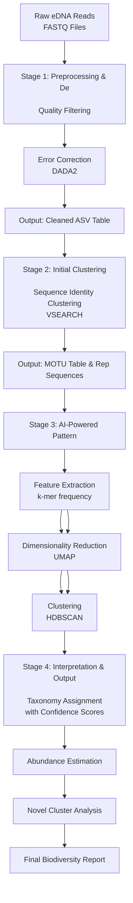

# AbyssAI
SIH problem Statement XY Solution, Team name: ; Collaborators: @shivamm-verma , @damanpreet2005 ,  

## Deployed on [Vercel](https://github.com/vercel/vercel)
> Check it out!
[https://abyss-ai.vercel.app/](https://abyss-ai.vercel.app/)

## 📐 Frontend local setup
```sh
git clone https://github.com/shivamm-verma/AbyssAI.git
```
```sh
cd client
```
```sh
npm install
```
```sh
npm run dev
```


## 🗃️ File Structuring

- Frontend: /client
- backend: /server
## Mermaid
